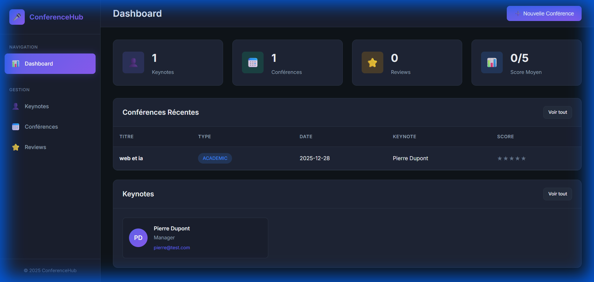
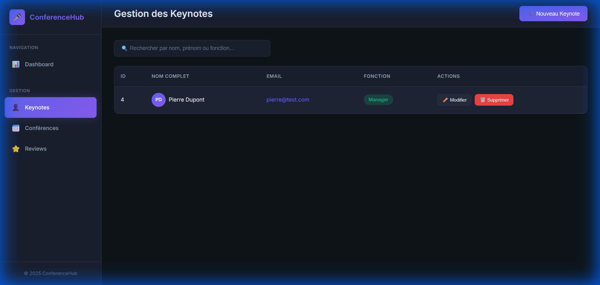

# Conference Management System

A full-stack microservices application for managing conferences, keynotes, and reviews.

## Table of Contents

- [Architecture](#architecture)
- [Technologies](#technologies)
- [Project Structure](#project-structure)
- [Prerequisites](#prerequisites)
- [Getting Started](#getting-started)
- [Services](#services)
- [API Documentation](#api-documentation)
- [Security](#security)
- [Screenshots](#screenshots)

---

## Architecture

```
                    ┌─────────────────┐
                    │   Angular UI    │
                    │   (Port 80/4200)│
                    └────────┬────────┘
                             │
                    ┌────────▼────────┐
                    │  API Gateway    │
                    │   (Port 8080)   │
                    └────────┬────────┘
                             │
           ┌─────────────────┼─────────────────┐
           │                 │                 │
   ┌───────▼───────┐ ┌───────▼───────┐ ┌───────▼───────┐
   │Keynote Service│ │Conference Svc │ │   Keycloak    │
   │  (Port 8081)  │ │  (Port 8082)  │ │  (Port 8180)  │
   └───────┬───────┘ └───────┬───────┘ └───────────────┘
           │                 │
           └────────┬────────┘
                    │
           ┌────────▼────────┐
           │ Discovery Svc   │
           │  (Port 8761)    │
           └─────────────────┘
```

---

## Technologies

### Backend
- Java 17
- Spring Boot 3.2.1
- Spring Cloud 2023.0.0
- Spring Cloud Gateway
- Spring Cloud Netflix Eureka
- Spring Security OAuth2 Resource Server
- Spring Data JPA
- H2 Database
- MapStruct
- Lombok
- OpenAPI / Swagger
- Resilience4J

### Frontend
- Angular 20
- TypeScript
- PrimeNG
- Keycloak JS Adapter

### Infrastructure
- Docker
- Docker Compose
- Keycloak 23
- PostgreSQL (for Keycloak)
- Nginx

---

## Project Structure

```
├── api-exam/
│   ├── discovery-service/    # Eureka Server
│   ├── gateway-service/      # API Gateway + Security
│   ├── keynote-service/      # Keynote management
│   └── conference-service/   # Conference & Review management
├── ui-exam/                  # Angular Frontend
├── keycloak/                 # Keycloak realm configuration
├── screenshots/              # Application screenshots
└── docker-compose.yml        # Docker orchestration
```

---

## Prerequisites

- Java 17+
- Maven 3.8+
- Node.js 18+
- Docker & Docker Compose
- Git

---

## Getting Started

### Option 1: Docker Deployment (Recommended)

```bash
# Clone the repository
git clone <repository-url>
cd test

# Build backend JARs
cd api-exam
mvn clean package -DskipTests
cd ..

# Start all services with Docker
docker-compose up --build
```

Access the application:
- Frontend: http://localhost
- API Gateway: http://localhost:8080
- Keycloak Admin: http://localhost:8180 (admin/admin)
- Eureka Dashboard: http://localhost:8761

### Option 2: Local Development

```bash
# Terminal 1: Discovery Service
cd api-exam/discovery-service
mvn spring-boot:run

# Terminal 2: Gateway Service
cd api-exam/gateway-service
mvn spring-boot:run

# Terminal 3: Keynote Service
cd api-exam/keynote-service
mvn spring-boot:run

# Terminal 4: Conference Service
cd api-exam/conference-service
mvn spring-boot:run

# Terminal 5: Angular Frontend
cd ui-exam
npm install
npm start
```

---

## Services

### Discovery Service (Eureka)
- Port: 8761
- Provides service registration and discovery

### Gateway Service
- Port: 8080
- Routes requests to appropriate microservices
- Handles CORS and security

### Keynote Service
- Port: 8081
- Manages keynote speakers
- Endpoints: `/api/keynotes/**`

### Conference Service
- Port: 8082
- Manages conferences and reviews
- Communicates with Keynote Service via OpenFeign
- Endpoints: `/api/conferences/**`, `/api/reviews/**`

---

## API Documentation

Swagger UI is available for each service:

- Keynote Service: http://localhost:8081/swagger-ui.html
- Conference Service: http://localhost:8082/swagger-ui.html

---

## Security

The application uses Keycloak for OAuth2/OIDC authentication.

### Default Users

| Username | Password | Roles |
|----------|----------|-------|
| admin | admin123 | ADMIN, USER |
| user1 | user123 | USER |

### Keycloak Configuration
- Realm: conference-realm
- Frontend Client: angular-client (public)
- Gateway Client: gateway-client (confidential)

---

## Screenshots

### Dashboard


### Keynotes Management


---

## Docker Services

| Service | Image | Port |
|---------|-------|------|
| postgres-keycloak | postgres:15-alpine | 5432 |
| keycloak | quay.io/keycloak/keycloak:23.0 | 8180 |
| discovery-service | Custom | 8761 |
| gateway-service | Custom | 8080 |
| keynote-service | Custom | 8081 |
| conference-service | Custom | 8082 |
| frontend | nginx:alpine | 80 |

---

## License

This project is for educational purposes.
